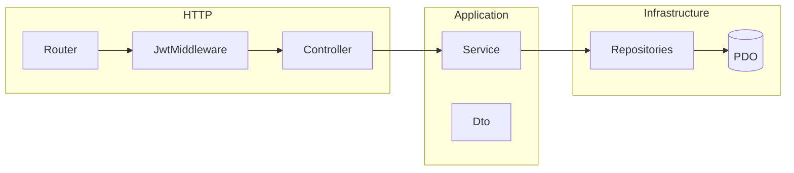

# Phased backend implementation (JWT + React-ready API)

## Scope and constraints

- **Source of truth**: [requirement.md](requirement.md) — users / artists / songs, RBAC, pagination, CSV for artists (manager-only), no ORM, raw SQL only.
- **Auth**: **JWT (Bearer)** for the future React app; backend must emit tokens on login and validate them on protected routes. Plan **CORS** for the frontend origin via env (exact URL later).
- **Layout**: create `**/home/proshore/Documents/web/RBAC/backend`** and `**/home/proshore/Documents/web/RBAC/frontend\*\`. Frontend: minimal placeholder (e.g. empty or README only) until you supply design.

## Linking `artist` users to catalog data

The spec allows only the `**artist`** role to create/update/delete songs. That requires knowing **which artist row** belongs to the logged-in user. Add a nullable `**users.artist_id`→`artists.id` (or equivalent) in migrations so services can enforce “this song belongs to my artist.” Super admins and artist managers bypass via role checks.

## Recommended backend layout (illustrative)

```text
backend/
  public/index.php          # front controller
  src/
    Http/                   # ControllerInterface, router, middleware, JsonResponse helpers
    Application/Service/    # business logic
    Application/Dto/        # request/response DTOs
    Domain/                   # role enums/constants, domain exceptions
    Infrastructure/
      Persistence/          # *Repository implementations (PDO + raw SQL)
      Security/             # JWT encode/decode/verify, password hasher
      Migration/            # MigrationInterface, runner, migration classes
  database/migrations/      # ordered PHP classes (up/down)
  config/
```

- **Controller contract**: every controller implements a single interface (e.g. `handle(Request): Response`) for uniform dispatch.
- **Repository interfaces**: three contracts — **User**, **Artist**, **Song** — with PDO implementations; services depend on interfaces only.
- **Services**: hold validation, RBAC, transactions, orchestration; **no SQL** in controllers.



---

## Phase 1 — Repository skeleton and tooling

- Add `**backend/composer.json**` with PSR-4 autoload (`src/` → namespace), PHP version constraint (e.g. 8.1+).
- `**public/index.php**`: bootstrap autoload, load env, build PDO, dispatch router (stub).
- **Config**: `.env.example` with `APP_ENV`, `DB_`, `JWT_SECRET`, `JWT_TTL`, `CORS_ORIGIN`.
- `**frontend/`**: add a short **README stating React will be added when design is ready (no app code required now).

**Exit criteria**: `composer install` works; hitting `public/index.php` returns a health JSON or 404 from router.

---

## Phase 2 — Migrations (PHP `up` / `down`)

- `**MigrationInterface` + runner that records applied versions in DB and runs pending migrations in order.
- Migration classes under `**database/migrations/`** (or `src/Infrastructure/Migration/Migrations/`) with `**up()`**and`\*\*down()\*\`.
- Initial schema:
  - `**users`: id, name, email, unique email, password hash, role enum, `artist_id` nullable FK, timestamps.
  - `**artists`: per requirement (name, dob, gender, address, first_release_year, `no_of_albums_released`, timestamps).
  - `**songs`: id, `artist_id` FK, title, album_name, genre (align enum with validation — pick one list and document), timestamps.

**Exit criteria**: fresh DB runs migrations idempotently; `down` works in dev for rollback.

---

## Phase 3 — HTTP layer: contract, routing, errors, CORS

- `**ControllerInterface`** with the required entry method; **abstract base optional later for shared JSON helpers (not required for contract).
- Simple **router** (method + path) mapping to controller instances wired in a **single bootstrap** (composition root).
- **Global JSON error handler** (consistent `{ message, code }` or similar); map domain exceptions to HTTP status.
- **CORS** middleware: `Access-Control-Allow-Origin` from env; handle `OPTIONS` preflight for API routes.

**Exit criteria**: non-auth routes can be hit; errors are JSON; OPTIONS succeeds for frontend origin placeholder.

---

## Phase 4 — JWT auth foundation

- **Password hashing**: `password_hash` / `password_verify`.
- **Endpoints**: `POST /auth/register`, `POST /auth/login` (returns JWT + user payload without secrets), `GET /auth/me` (Bearer required), `POST /auth/logout` if using denylist (optional v1: stateless JWT only — document that logout is client-side discard until refresh tokens exist).
- **JWT**: HS256 with secret from env; claims at minimum: `sub` (user id), `role`, optional `artist_id`, `exp`.
- **Middleware**: validate Bearer token, attach **user context** to request for downstream controllers/services.

**Exit criteria**: register → login → access protected route with `Authorization: Bearer`.

---

## Phase 5 — Users CRUD (super_admin)

- Service + repository methods: list (paginated), create, update, delete.
- **RBAC**: only `super_admin`; return **403** otherwise.
- DTOs for create/update/list response (no password in responses).
- **Pagination**: query params `page`, `per_page` (sensible caps), total count in response.

**Exit criteria**: Postman/curl can exercise full user admin flow as super_admin.

---

## Phase 6 — Artists (super_admin + artist_manager)

- List with pagination; create/update/delete per matrix (**artist_manager** for create/update/delete; super_admin may need explicit rules — implement as: **super_admin** full access to artists list + view songs; **artist_manager** create/update/delete + CSV; align with [requirement.md](requirement.md) lines 76–87).
- **CSV export**: `GET` with `Accept: text/csv` or dedicated path; stream CSV with correct headers.
- **CSV import**: `POST` multipart; validate rows; transactional batch insert/update where possible; clear error report for bad rows.

**Exit criteria**: RBAC verified; CSV round-trip works for allowed roles.

---

## Phase 7 — Songs (nested under artist)

- Routes scoped by `**artist_id` (e.g. `GET/POST /artists/{id}/songs`, `PUT/DELETE /artists/{id}/songs/{songId}`).
- **View**: super_admin, artist_manager, artist.
- **Mutations**: **artist** only — enforce `artist` role **and** `users.artist_id` matches route `artist_id` (unless super_admin/artist_manager override per spec — spec says only **artist** creates/updates/deletes; treat **super_admin** and **artist_manager** as **no** song mutations unless you decide otherwise; **strict reading of the table**: only `artist` role for create/update/delete).

**Exit criteria**: song CRUD matches the access table; cross-artist access returns 403.

---

## Phase 8 — Hardening and API polish

- Input validation centralization (reuse in services).
- Rate limit on `POST /auth/login` (optional: simple file/redis-free throttle or web server level).
- **API versioning** prefix optional: `/api/v1/...` for future compatibility.
- `**backend/README.md`: how to run migrations, env vars, example curl with JWT.

**Exit criteria**: documented, consistent responses, ready for React integration when design arrives.

---

## Frontend folder (this pass)

- `**frontend/`: placeholder only; no React scaffold until you provide design (avoids rework).

---

## Out of scope for backend-first plan

- React UI, routing, and assets (deferred).
- Refresh tokens / OAuth (can add after v1 JWT).
- Automated test suite (optional follow-up: PHPUnit for services + integration tests against DB).
